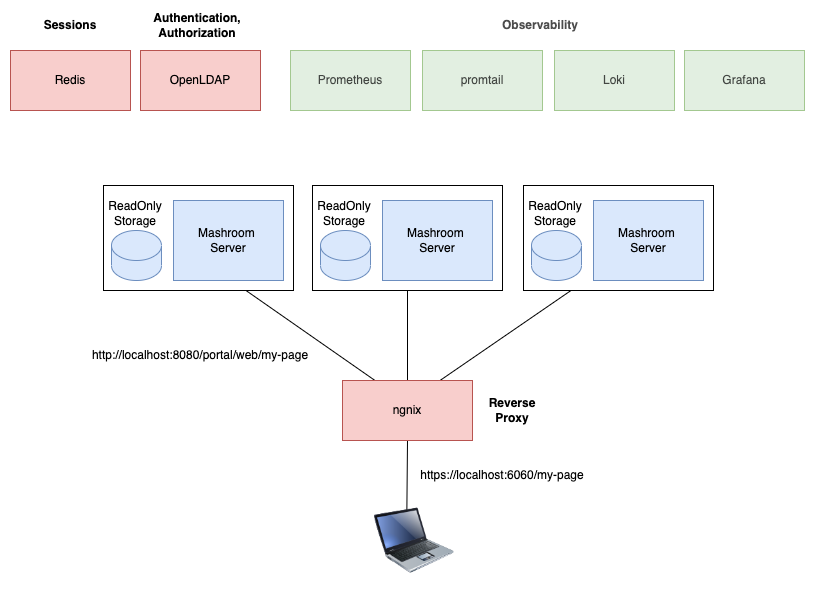

# Learning Mashroom Lesson 5

Video: https://youtu.be/CGFg64txTfY

# Setup

# Usage

## Production

    cd prod
    docker-compose up

The Portal will be available at https://localhost:6060 (reverse proxy)

The actual Portal nodes are available at:
 * http://localhost:8080/portal/web
 * http://localhost:8081/portal/web
 * http://localhost:8082/portal/web

Users: professor/professor, fry/fry, leela/leela, bender/bender

The Grafana dashboard will be available at: http://localhost:3000 - login with admin/test

## Development

    npm i
    npm start

The Portal will be available at http://localhost:8080/portal/web

Users: admin/admin, john/john

# Hints

 * The following LDAP test server is used in this demo: https://github.com/rroemhild/docker-test-openldap
